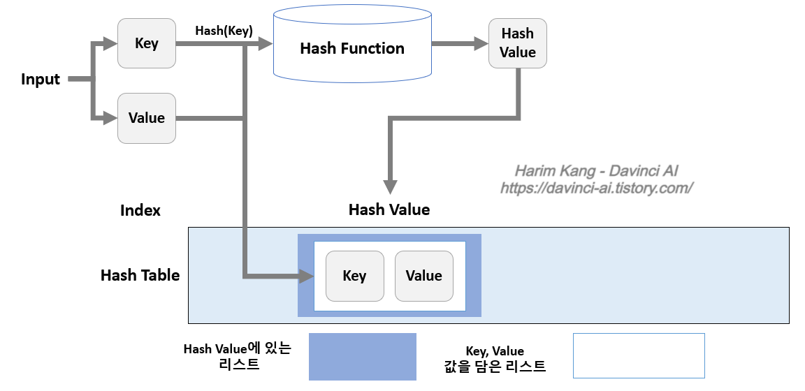

# Hash

## :world_map: Map
**엔트리**라는 키-값 쌍을 저장하는 ADT로 associative array, dictionary로도 불린다. 맵 ADT는 **각 키는 유일**하며 **키와 값의 관계를 매핑**으로 정의한다. 

맵은 보통 **search(lookup), insert, delete** 연산을 사용한다. 엄격하게 구분을 짓자면 map은 **하나의 키에 하나의 값**만 허용(주민등록증)되고 dictionary의 경우 **하나의 키에 여러 값**이 허용(사전에서 어떤 단어의 여러 뜻)된다.

이러한 맵을 구현하는 방법은 아래와 같다.
* 이진 트리
* 해시 테이블
  
이진 트리의 경우 위의 연산이 **O(logn)**(최악 O(n))이지만 찾으려는 값의 가까운 값을 찾을 수 있다. 해시 테이블의 경우 연산이 **O(1)**(최악 O(n)) 이지만 이진 트리와는 다르게 찾으려는 값의 가장 가까운 값을 찾기에는 다른 연산을 구현해야한다. cpp의 경우 std::ordered_map은 red-black tree로 구현되고 std::unordered_map은 hash 테이블 방식으로 구현되어 있다. 

appendix: [ADT란](https://gamedevlog.tistory.com/3)

<br>
<br>

## :fire: Hash table
### 단어 정리 및 설명
* **hash table**: map ADT를 구현하는 방법 중 하나로 삽입, 탐색, 삭제가 평균 O(1)을 이룬다.

* **해시 함수(해싱)**: 키를 input으로 받고 해시 값(인덱스)를 output으로 출력하는 함수. 보통 modular 연산을 통해 구현한다. **여기서 해시 값은 값과는 다르다**. 이런 매핑하는 과정을 해싱이라고 한다.

* **버킷(슬롯)**: 해시 값을 인덱스로 사용하여 값을 저장하는 공간.

* **충돌(collision)**:  다른 두개의  키가 하나의 해시 값에 할당되는 문제.




여기서 hash value와 value를 잘 구분해야 한다.

* 해시 함수는 언제나 동일한 해시 값을 리턴하기에 탐색(lookup)을 하기에 매우 효율적이다. 
* 하지만 **버킷의 사이즈가 유한하기 때문에 거의 모든 해시 테이블에서는 충돌을 일으나며** 충돌이 일어났을 때 이를 처리 해줘야한다.
* 이를 통계적으로 계산하기 위해 load factor(엔트리의 개수 / 버킷의 개수)을 사용한다.

<br>
<br>

### :hammer: Colision handling
충돌 해결을 위해서 크게 2가지로 나뉜다.
* chaining (separate chaining이라고도 불린다)
* open adressing

<br>

:chains:**chaining**

* 체이닝의 경우 충돌이 발생하면 해당 **버킷에 이어서 저장**하는 방법이다. cpp의 경우 std::vector와 같은 가변 배열을 이용해서 구현할 수 있다.
* 모든 키값이 하나의 해시 값으로만 리턴되는 최악의 경우 해당 버킷에 이어진 값들을 다 확인해야 하므로 선형시간 O(n)이 걸릴 것이다.

아래의 그림은 chaining을 나타낸다.


<br>

:card_index_dividers:**open addressing**

충돌이 일어나면 이어서 값을 저장하는 것이 아닌 **정해진 규칙을 통해 비어진 다른 버킷을 찾아 값을 저장하는 방법**이다. 이 정해진 규칙은 아래와 같다.
* linear probing: 인덱스에 이미 값이 있으면 비어 있는 버킷을 찾을 때까지 한칸씩 확인하는 방법.
* quadrastic probing: 빈 버킷을 찾을 때까지 qudrastic하게 찾는 방법.
* double hashing: 인덱스에 이미 값이 있으면 다른 해시 함수를 사용하는 방법.

probing 방법


[double hashing에 대해서 좀 더 알고 싶다면](https://m.blog.naver.com/beaqon/221300416700)

open adressing 방법들을 비교하자면 load factor가 0.7이상되면 기하급수적으로 충돌 확률이 올라간다.

<br>

:crossed_swords:**chaining vs open addressing**

chaining의 장점
* 효과적으로 **구현하기 간단**하다.
* 같은 해시 값들이 많이 나오면 open addressing의 경우 데이터들이 몰리는 클러스터링이 생기지만 chaining의 경우 **클러스터링은 고려하지 않아도 된다.**
* 테이블이 채워져도 성능 저하가 **linear하게 발생**한다.

open addressing의 장점
* open addressing은 **포인터를 저장할 필요가 없고 추가적인 저장 공간이 필요 없으므로** 비교적 메모리 효율이 높다.
* 포인터를 사용하지 않으므로써 **serialization**이 용이하다.

아래 그림은 load factor에 따른 탐색별 cache miss의 평균이다.


<br>
<br>

### 해시의 단점
* 해시 테이블은 데이터를 무작위적으로 저장하기 때문에 빈 버킷이 생겨나 정렬이나 순회같이 모든 값을 봐야할 때 효율이 떨어지는 현상이 발생한다.
* 키에 따른 질 좋은 해시 함수를 다른 비교함수에 비해 구현하기 어렵고 좋은 해시 함수인지 증명하기도 어려운 문제가 있다.

<br>
<br>

## unordered_map
STL 컨테이너는 크게 시퀀스, 연관 컨테이너로 나뉜다.
* 시퀀스 컨테이너 : vector, list, deque 와 같이 순서 있게 자료를 보관
* 연관 컨테이너 : 어떠한 key와 짝을 이루어 자료를 보관하며 만들어진 key 값을 이용해서 O(1) 시간만에 자료에 접근 가능

cpp에서 해시 테이블을 사용하기 위해서는 연관 컨테이너인 unordered_map이라는 STL을 사용한다. 충돌 해결을 위해서는 **chaining**을 쓰는 것으로 알려져있다.

`template< class Key, class T, class Hash = std::hash<Key>, class KeyEqual = std::equal_to<Key>, class Allocator = std::allocator< std::pair<const Key, T> >> class unordered_map;`
<br>

### unordered_map 예시
```cpp
#include <iostream>
#include <string>
#include <unordered_map>
using namespace std;

int main(){
    
    unordered_map<string,int> um;
    unordered_map<int, string> im;
    
    if(um.empty()){
        cout << "unordered_map은 비어있습니다" << endl;
    }
    
    cout << "string이 값일 때  비어 있는 값을 찾을 때 : " << im[1] << endl;
    cout << "int가 값일 때 비어 있는 값을 찾을 때 : " << um["a"] << endl;

    um.insert(make_pair("key",1));
    um["banana"]=2;
    um.insert({"melon",3});
    
    cout<<"unordered_map의 크기는 "<<um.size()<<" 입니다"<<endl;
    
    // auto로 해도 무방
    for(pair<string,int> elem : um){
        cout<<"key : "<<elem.first<<" value : "<<elem.second<<endl;
    }
    
    // find 대신 count로 확인 가능
    if(um.find("banana")!=um.end()){
        um.erase("banana");
        //um["banana"] = 0;     << 이렇게 하면 size에 반영이 안 됨
    }

    cout << "melon count : " << um.count("melon") << endl;
    cout << "deleted banana count : " << um.count("banana") << endl;
    
    cout<<"unordered_map의 크기는 "<<um.size()<<" 입니다"<<endl;
    for(auto elem : um){
        cout<<"key : "<<elem.first<<" value : "<<elem.second<<endl;
    }

    um.clear();
    cout << "after clear" << endl;
    for(auto elem : um){
        cout<<"key : "<<elem.first<<" value : "<<elem.second<<endl;
    }
    
    return 0;
}

// output
// unordered_map은 비어있습니다
// string이 값일 때  비어 있는 값을 찾을 때 : 
// int가 값일 때 비어 있는 값을 찾을 때 : 0
// unordered_map의 크기는 4 입니다
// key : banana value : 2
// key : melon value : 3
// key : key value : 1
// key : a value : 0
// melon count : 1
// deleted banana count : 0
// unordered_map의 크기는 3 입니다
// key : melon value : 3
// key : key value : 1
// key : a value : 0
// after clear

//reference: https://math-coding.tistory.com/31
```

<br>
<br>

## 자료구조 구현
### 1. open addressing
```cpp
#include <stdio.h>
#include <stdlib.h>
#include <string.h>
#include <stdint.h>
#include <stdbool.h>

#define MAX_NAME 256
#define TABLE_SIZE 10
#define DELETED_NODE (person*)(0xFFFFFFFFFFFFFFUL)

/* 구조체 선언 */
typedef struct {
    char name[MAX_NAME];
    int age;
} person;
/* 자료형이 구조체인 해시테이블 생성, NULL로 초기화 */
person *hash_table[TABLE_SIZE];

void init_hash_table() {
    for (int i=0; i < TABLE_SIZE; i++) {
        hash_table[i] = NULL;
    }
}

/* 해시 함수 */
unsigned int hash(char *name) {
    int length = strlen(name);
    unsigned int hash_value = 0;
    for (int i = 0; i < length; i++) {
        hash_value += name[i];
        hash_value = (hash_value * name[i]) % TABLE_SIZE;
    }
    return hash_value;
}

/* 기본 기능 1)insert */
bool hash_table_insert(person *p) {
    if (p == NULL) return false;
    int index = hash(p -> name);
    // 해당 인덱스부터 한칸씩 이동하면서 비어있는지 확인
    for (int i = 0; i < TABLE_SIZE; i++) {
        int try = (i + index) % TABLE_SIZE;
        // 비어있으면 삽입
        if (hash_table[try] == NULL || hash_table[try] == DELETED_NODE) {
            hash_table[try] = p;
            return true;
        }
    }
    return false;
}

/* 기본 기능 2)lookup */
person *hash_table_lookup(char *name) {
    int index = hash(name);
    // 해당 인덱스부터 한칸씩 이동하면서 insert하려는 name이 이미 있는지 확인
    for (int i = 0; i < TABLE_SIZE; i++) {
        int try = (i + index) % TABLE_SIZE;
        // 아직 없는 경우 
        if (hash_table[try] == NULL) {
            return false;
        }
        // 원래 있던 데이터가 삭제된 자리인 경우 
        /* 이 부분이 없다면, 뒤에 있을 수 있는 중복 데이터를 발견하지 못한채 
        앞의 '아직 없는 경우'로 인식, false를 return하고 끝나버리는 불상사 발생 */
        if (hash_table[try] == DELETED_NODE) continue;
        // 이미 있는 경우
        if (strncmp(hash_table[try] -> name, name, TABLE_SIZE) == 0) {
            return hash_table[try];
        }
    }
    return NULL;
}

/* 기본 기능 3)delete */
person *hash_table_delete(char *name) {
    int index = hash(name);
    for (int i = 0; i < TABLE_SIZE; i++) {
        int try = (i + index) % TABLE_SIZE;
        if (hash_table[try] == NULL) return NULL;
        if (hash_table[try] == DELETED_NODE) continue;
        if (strncmp(hash_table[try] -> name, name, TABLE_SIZE) == 0) {
            person *tmp = hash_table[try];
            hash_table[try] = DELETED_NODE;
            return tmp;
        }
    }
    return NULL;
}
void print_table() {
    printf("Start\n");
    for(int i = 0; i < TABLE_SIZE; i++) {
        if (hash_table[i] == NULL) {
            printf("\t%i\t---\n", i);
        } else if (hash_table[i] == DELETED_NODE) {
            printf("\t%i\t---<deleted>\n", i);
        } else {
            printf("\t%i\t%s\n", i, hash_table[i] -> name);
        }
    }
    printf("End\n");
}

int main(){

    init_hash_table();
    print_table();

    person jacob = {.name="Jacob", .age=256};
    person kate = {.name="Kate", .age=27};
    person mpho = {.name="Mpho", .age=14};
    person sarah = {.name="Sarah", .age=54};
    person edna = {.name="Edna", .age=15};
    person maren = {.name="Maren", .age=25};
    person eliza = {.name="Eliza", .age=34};
    person robert = {.name="Robert", .age=1};
    person jane = {.name="Jane", .age=75};
    

    hash_table_insert(&jacob);
    hash_table_insert(&kate);
    hash_table_insert(&mpho);
    hash_table_insert(&sarah);
    hash_table_insert(&edna);
    hash_table_insert(&maren);
    hash_table_insert(&eliza);
    hash_table_insert(&robert);
    hash_table_insert(&jane);
    print_table();

    person *tmp = hash_table_lookup("Mpho");
    if (tmp == NULL) {
        printf("Not found!\n");
    } else {
        printf("Found %s.\n", tmp -> name);
    }

    hash_table_delete("Mpho");
    tmp = hash_table_lookup("George");
    if (tmp == NULL) {
        printf("Not found!\n");
    } else {
        printf("Found %s.\n", tmp -> name);
    }

    print_table();
    /* 
        0       Maren
        1       Kate
        2       Jacob
        3       Robert
        4       Sarah
        5       ---<deleted>
        6       Jane
        7       Eliza
        8       ---
        9       Edna
    */
    return 0;
}
```
<br>

### 2.chaining
```cpp
#include <stdio.h>
#include <stdlib.h>
#include <string.h>
#include <stdint.h>
#include <stdbool.h>

#define MAX_NAME 256
#define TABLE_SIZE 10

/* 구조체 선언 */
typedef struct person {
    char name[MAX_NAME];
    int age;
    struct person *next; // 구조체 포인터 변수 추가
} person;
/* 자료형이 구조체인 해시테이블 생성, NULL로 초기화 */
person *hash_table[TABLE_SIZE];

void init_hash_table() {
    for (int i=0; i < TABLE_SIZE; i++) {
        hash_table[i] = NULL;
    }
}

/* 해시 함수 */
unsigned int hash(char *name) {
    int length = strlen(name);
    unsigned int hash_value = 0;
    for (int i = 0; i < length; i++) {
        hash_value += name[i];
        hash_value = (hash_value * name[i]) % TABLE_SIZE;
    }
    return hash_value;
}

/* 기본 기능 1)insert */
bool hash_table_insert(person *p) {
    if (p == NULL) return false;
    int index = hash(p -> name);
    p -> next = hash_table[index]; // 앞에 삽입
    hash_table[index] = p;
    return true;
}

/* 기본 기능 2)lookup */
person *hash_table_lookup(char *name) {
    int index = hash(name);
    person *tmp = hash_table[index];
    // 해당 인덱스의 리스트를 이동
    while (tmp != NULL && strncmp(tmp -> name, name, TABLE_SIZE) != 0) {
        tmp = tmp -> next;
    }
    // 없으면 tmp == NULL
    return tmp;
}

/* 기본 기능 3)delete */
person *hash_table_delete(char *name) {
    int index = hash(name);
    person *tmp = hash_table[index];
    person *prev = NULL;
    // 해당 인덱스가 비어있지 않은 경우, 해당 인덱스의 리스트를 이동
    while (tmp != NULL && strncmp(tmp -> name, name, TABLE_SIZE) != 0) {
        prev = tmp;
        tmp = tmp -> next;
    } 
    // 해당 인덱스가 비어있거나 리스트에 delete하려는 name이 없는 경우
    if (tmp == NULL) return NULL;
    // delete하려는 name이 리스트 맨 앞에 있는 경우(loop에 진입조차 하지 않은)
    if (prev == NULL) {
        // 삭제
        hash_table[index] = tmp -> next;
    } else { // 중간 등 어딘가에 있는 경우(loop가 멈춘 그 위치)
        // 삭제
        prev -> next = tmp -> next;
    }
    return tmp;
}
void print_table() {
    printf("Start\n");
    for(int i = 0; i < TABLE_SIZE; i++) {
        if (hash_table[i] == NULL) {
            printf("\t%i\t---\n", i);
        } else {
            printf("\t%i\t", i);
            person *tmp = hash_table[i];
            while (tmp != NULL) {
                printf("%s - ", tmp -> name);
                tmp = tmp -> next;
            }
            printf("\n");
        }
    }
    printf("End\n");
}

int main(){

    init_hash_table();
    print_table();

    person jacob = {.name="Jacob", .age=256};
    person kate = {.name="Kate", .age=27};
    person mpho = {.name="Mpho", .age=14};
    person sarah = {.name="Sarah", .age=54};
    person edna = {.name="Edna", .age=15};
    person maren = {.name="Maren", .age=25};
    person eliza = {.name="Eliza", .age=34};
    person robert = {.name="Robert", .age=1};
    person jane = {.name="Jane", .age=75};
    

    hash_table_insert(&jacob);
    hash_table_insert(&kate);
    hash_table_insert(&mpho);
    hash_table_insert(&sarah);
    hash_table_insert(&edna);
    hash_table_insert(&maren);
    hash_table_insert(&eliza);
    hash_table_insert(&robert);
    hash_table_insert(&jane);
    print_table();

    person *tmp = hash_table_lookup("Jacob");
    if (tmp == NULL) {
        printf("Not found!\n");
    } else {
        printf("Found %s.\n", tmp -> name);
    }

    hash_table_delete("Mpho");
    tmp = hash_table_lookup("George");
    if (tmp == NULL) {
        printf("Not found!\n");
    } else {
        printf("Found %s.\n", tmp -> name);
    }

    print_table();
    /* 
        0       Maren - 
        1       Jane - Kate - 
        2       Robert - Jacob - 
        3       ---
        4       Sarah - 
        5       ---
        6       ---
        7       Eliza - 
        8       ---
        9       Edna - 
    */
    return 0;
}
```

<br>
<br>

### Reference
http://egloos.zum.com/sweeper/v/925740

https://en.wikipedia.org/wiki/Hash_table

C++로 구현하는 자료구조와 알고리즘(책)
