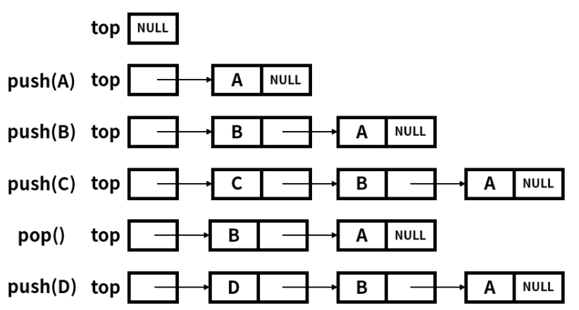

# Stack
## :bamboo:Definition
스택은 여러 원소를 다루는 ADT로 크게 2개의 메인 연산을 가진다.
* **push**: 스택의 맨위에 원소를 넣는다.
* **pop**: 스택의 맨위의 원소를 뺀다.

스택은 **선형 자료구조**로써 **last in first out**(LIFO)라는 원리로 작동하는 데 스택에 쌓을 때(push)는 맨위에 쌓이고 나올 때(pop)는 마지막에 쌓인 원소가 나온다.
아래의 그림이 직관적으로 스택을 설명한다.


책에 따라서는 메인 연산에서 top이라는 연산을 추가하여 3개라고 설명하는 데도 있다. top은 **최상위 원소를 제거하지 않고 리턴**한다. 여담으로 가장 상위의 원소를 top이라고도 부르기도 한다.

<br>

## :straight_ruler:Stack implementation
스택은 간단한 자료 구조로 배열과 링크드 리스트로 손쉽게 구현할 수 있다. 보통 위에서 언급한 3개의 **연산과 비어있는 지 확인하는 empty**, **스택의 원소 개수를 리턴하는 size**를 구현한다.

아래 그림처럼 스택을 구현할 때 top을 트리의 root처럼 정하고 구현하기도 한다. 



<br>

## :busts_in_silhouette:Common uses of stack
스택이 쓰이는 곳의 예시는 아래와 같다.
* git의 stash
* backtracking
* 메인 메모리 스택
* html 태그 해석

<br>

## Stack
cpp에서 스택은 시퀀스 컨테이너인 stack을 이용해서 만든다.

`template < class T, class Container = std::deque<T> > class stack;`

```cpp
#include <iostream>
#include <stack>
#include <vector>
using namespace std;
 
int main(void){
    stack<int> st;
    stack<int> st1(st);     //이런식으로 초기화도 가능
    vector<int> v;
    stack<int, vector<int>> st2(v);
    
    st.push(10);
    st.push(20);
    st.push(30);
    st.push(40);
    st.push(50);
    
    cout << "st.size() : " << st.size() << endl;
    cout << "st.top() -> st.pop()" << endl;
    while(!st.empty()){
        cout << st.top() << endl;
        st.pop();
    }    
    return 0;    
}

// output
// st.size() : 5
// st.top() -> st.pop()
// 50
// 40
// 30
// 20
// 10

//reference: https://blockdmask.tistory.com/100
```

<br>

## 스택 구현
배열로 구현
```cpp
#include <stdio.h>
#include <limits.h>
#include <stdbool.h>
#include <stdlib.h>

#define STACK_LEGTH 5
#define EMPTY (-1)
#define STACK_EMPTY INT_MIN // 뭐든지 정해놓은 규칙대로 선언하면 된다.

typedef struct {
    int values[STACK_LEGTH];
    int top = EMPTY;
} stack;

bool push(stack *mystack, int value) {
    // STACK_LEGTH - 1 = last element
    if (mystack -> top >= STACK_LEGTH - 1) return false; // stack is full

    mystack -> top++;
    mystack -> values[mystack -> top] = value;
    return true;
}

int pop(stack *mystack) {
    if (mystack -> top == EMPTY) return STACK_EMPTY;

    int result = mystack -> values[mystack -> top];
    mystack -> top--;
    return result;
}

int main() {
    stack s1;
    s1.top = EMPTY;
    stack s2;
    s2.top = EMPTY;
    stack s3;
    s3.top = EMPTY;

    push(&s1, 56);
    push(&s2, 78);
    push(&s3, 13);

    int t;
    while ((t = pop()) != STACK_EMPTY) {
        printf("t = %d\n", t);
    }
}
```
list로 구현
```cpp
#include <stdio.h>
#include <limits.h>
#include <stdbool.h>
#include <stdlib.h>

#define STACK_LEGTH 5
#define EMPTY (-1)
#define STACK_EMPTY INT_MIN // 뭐든지 정해놓은 규칙대로 선언하면 된다.

typedef struct {
    int values[STACK_LEGTH];
    int top = EMPTY;
} stack;

bool push(stack *mystack, int value) {
    // STACK_LEGTH - 1 = last element
    if (mystack -> top >= STACK_LEGTH - 1) return false; // stack is full

    mystack -> top++;
    mystack -> values[mystack -> top] = value;
    return true;
}

int pop(stack *mystack) {
    if (mystack -> top == EMPTY) return STACK_EMPTY;

    int result = mystack -> values[mystack -> top];
    mystack -> top--;
    return result;
}

int main() {
    stack s1;
    s1.top = EMPTY;
    stack s2;
    s2.top = EMPTY;
    stack s3;
    s3.top = EMPTY;

    push(&s1, 56);
    push(&s2, 78);
    push(&s3, 13);

    int t;
    while ((t = pop()) != STACK_EMPTY) {
        printf("t = %d\n", t);
    }
}
```
<br>
<br>

# Queue

## :dango:Definition
큐는 스택과 마찬가지로 여러 원소를 다루는 ADT이고 선형 자료구조이다. 큐의 메인 연산 2개는 아래와 같다.
* **enqueue** : 큐의 뒤(rear)에 원소를 넣는다.
* **dequeue** : 큐의 앞(front)의 원소를 삭제한다.

큐는 **first in first out**(FIFO)의 원리로 작동하는 데 스택의 pop과는 다르게 먼저 들어간 원소가 나오게 된다.


큐는 맨 앞과 뒤의 원소들을 각각 front, rear(back)으로 표현하고 스택과 비슷하게 empty, size를 같이 구현한다.

<br>

## :busts_in_silhouette:Common usees of queue
* bfs
* 프린터

<br>

## queue
큐도 스택과 마찬가지로 시퀀스 컨테이너인 queue를 사용한다.

`template< class T, class Container = std::deque<T> > class queue;`

```cpp
#include <iostream>
#include <queue>
#include <list>
#include <deque>
#include <vector>
using namespace std;

int main() {

	//큐 선언
    list<int> li(10, 1);
    deque<int> dq(3, 100);      //{100, 100, 100}
    vector<int> v;

	queue<int> q;
    queue<int> q1(q);

    queue<int> q2(dq);              //deque는 템플릿 지정 필요 없음
    queue<int, deque<int>> q3(dq);
    queue<int, list<int>> q4(li);   //템플렛 두번째 인수에 list를 넣으면 초기화 가능
    queue<int, vector<int>> q5(v);

	//큐에 요소 추가하기
	for (int i = 0; i < 5; i++) {
		q.push(i);
        q1.push(i+10);
	}

	//요소 삭제하기
	int output = q.front();
	q.pop();

    //데이터 스왑
    swap(q, q1);

	
	//큐의 전체요소 출력하기
	while (!q.empty()) {
		cout << q.front() << " ";
		q.pop();
	}

	return 0;
}

// output
// 10 11 12 13 14
```

<br>

## 큐 구현
리스트로 구현
```cpp
#include <stdio.h>
#include <limits.h>
#include <stdbool.h>
#include <stdlib.h>

#define QUEUE_EMPTY INT_MIN

typedef struct node {
    int value;
    struct node *next;
} node;

typedef struct {
    node *head;
    node *tail;
} queue;

void init_queue(queue *q) {
    q -> head = NULL;
    q -> tail = NULL;
}

bool enqueue(queue *q, int value) {
    node *newnode = malloc(sizeof(node));
    if (newnode == NULL) return false;
    newnode -> value = value;
    // newnode의 value는 end of the list여야 함
    newnode -> next = NULL;
    
    // 비어있지 않은 queue였을 경우 원래 tail 끝에 붙여주기
    if (q -> tail != NULL) {
        q -> tail -> next = newnode;
    }
    // newnode를 tail로 만들기
    q -> tail = newnode;

    // 비어있었을 경우 newnodefmf head로 만들기
    if (q -> head == NULL) {
        q -> head = newnode;
    }
    return true;
}

int dequeue(queue *q) {
    // 비어있는지 확인
    if (q -> head == NULL) return QUEUE_EMPTY;
    node *tmp = q -> head;
    int result = tmp -> value;
    q -> head = q -> head -> next;
    // 처리 후 빈 queue가 되었을 때 
    if (q -> head == NULL) {
        q -> tail = NULL;
    }
    free(tmp);
    return result;
}

int main() {
    queue q1, q2, q3;

    init_queue(&q1);
    init_queue(&q2);
    init_queue(&q3);

    enqueue(&q1, 56);
    enqueue(&q2, 78);
    enqueue(&q2, 13);
    enqueue(&q2, 98);
    int a;
    while ((a = dequeue(&q2)) != QUEUE_EMPTY) {
        printf("a = %d\n", a);
    }
    /*
    a = 78
    a = 13
    a = 98
    */
}
```


**Reference**

https://en.wikipedia.org/wiki/Stack_(abstract_data_type)

https://en.wikipedia.org/wiki/Queue_(abstract_data_type)