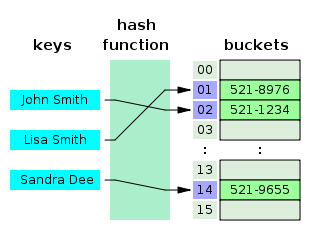

# Hash

## :world_map: Map
**엔트리**라는 키-값 쌍을 저장하는 ADT로 associative array, dictionary로도 불린다. 맵 ADT는 **각 키는 유일**하며 **키와 값의 관계를 매핑**으로 정의한다. 

맵은 보통 **search(lookup), insert, delete** 연산을 사용한다. 엄격하게 구분을 짓자면 map은 **하나의 키에 하나의 값**만 허용(주민등록증)되고 dictionary의 경우 **하나의 키에 여러 값**이 허용(사전에서 어떤 단어의 여러 뜻)된다.

이러한 맵을 구현하는 방법은 아래와 같다.
* 이진 트리
* 해시 테이블
  
이진 트리의 경우 위의 연산이 **O(logn)**(최악 O(n))이지만 찾으려는 값의 가까운 값을 찾을 수 있다. 해시 테이블의 경우 연산이 **O(1)**(최악 O(n)) 이지만 이진 트리와는 다르게 찾으려는 값의 가장 가까운 값을 찾기에는 다른 연산을 구현해야한다. cpp의 경우 std::ordered_map은 red-black tree로 구현되고 std::unordered_map은 hash 테이블 방식으로 구현되어 있다. 

appendix: [ADT란](https://gamedevlog.tistory.com/3)

 
 

## :fire: Hash table
### 단어 정리 및 설명
* **hash table**: map ADT를 구현하는 방법 중 하나로 삽입, 탐색, 삭제가 평균 O(1)을 이룬다.

* **해시 함수(해싱)**: 키를 input으로 받고 해시 값(인덱스)를 output으로 출력하는 함수. 보통 modular 연산을 통해 구현한다. **여기서 해시 값은 값과는 다르다**. 이런 매핑하는 과정을 해싱이라고 한다.

* **버킷(슬롯)**: 해시 값을 인덱스로 사용하여 값을 저장하는 공간.

* **충돌(collision)**:  다른 두개의  키가 하나의 해시 값에 할당되는 문제.

여기서 00, 01, 02가 해시 값(hash value)이 되고 버킷에 들어가는 것이 값(value)이다.

* 해시 함수는 언제나 동일한 해시 값을 리턴하기에 탐색(lookup)을 하기에 매우 효율적이다. 
* 하지만 **버킷의 사이즈가 유한하기 때문에 거의 모든 해시 테이블에서는 충돌을 일으나며** 충돌이 일어났을 때 이를 처리 해줘야한다.
* 이를 통계적으로 계산하기 위해 load factor(엔트리의 개수 / 버킷의 개수)을 사용한다.

 
 

### :hammer: Colision handling
충돌 해결을 위해서 크게 2가지로 나뉜다.
* chaining (separate chaining이라고도 불린다)
* open adressing

 

:chains:**chaining**

* 체이닝의 경우 충돌이 발생하면 해당 **버킷에 이어서 저장**하는 방법이다. cpp의 경우 std::vector와 같은 가변 배열을 이용해서 구현할 수 있다.
* 모든 키값이 하나의 해시 값으로만 리턴되는 최악의 경우 해당 버킷에 이어진 값들을 다 확인해야 하므로 선형시간 O(n)이 걸릴 것이다.

아래의 그림은 chaining을 나타낸다.

 

:card_index_dividers:**open addressing**

충돌이 일어나면 이어서 값을 저장하는 것이 아닌 **정해진 규칙을 통해 비어진 다른 버킷을 찾아 값을 저장하는 방법**이다. 이 정해진 규칙은 아래와 같다.
* linear probing: 인덱스에 이미 값이 있으면 비어 있는 버킷을 찾을 때까지 한칸씩 확인하는 방법.
* quadrastic probing: 빈 버킷을 찾을 때까지 qudrastic하게 찾는 방법.
* double hashing: 인덱스에 이미 값이 있으면 다른 해시 함수를 사용하는 방법.

probing 방법

[double hashing에 대해서 좀 더 알고 싶다면](https://m.blog.naver.com/beaqon/221300416700)

open adressing 방법들을 비교하자면 load factor가 0.7이상되면 기하급수적으로 충돌 확률이 올라간다.

 

:crossed_swords:**chaining vs open addressing**

chaining의 장점
* 효과적으로 **구현하기 간단**하다.
* 같은 해시 값들이 많이 나오면 open addressing의 경우 데이터들이 몰리는 클러스터링이 생기지만 chaining의 경우 **클러스터링은 고려하지 않아도 된다.**
* 테이블이 채워져도 성능 저하가 **linear하게 발생**한다.

open addressing의 장점
* open addressing은 **포인터를 저장할 필요가 없고 추가적인 저장 공간이 필요 없으므로** 비교적 메모리 효율이 높다.
* 포인터를 사용하지 않으므로써 **serialization**이 용이하다.

아래 그림은 load factor에 따른 탐색별 cache miss의 평균이다.

 
 

### 해시의 단점
* 해시 테이블은 데이터를 무작위적으로 저장하기 때문에 빈 버킷이 생겨나 정렬이나 순회같이 모든 값을 봐야할 때 효율이 떨어지는 현상이 발생한다.
* 키에 따른 질 좋은 해시 함수를 다른 비교함수에 비해 구현하기 어렵고 좋은 해시 함수인지 증명하기도 어려운 문제가 있다.

 
 

### Reference
http://egloos.zum.com/sweeper/v/925740

https://en.wikipedia.org/wiki/Hash_table

C++로 구현하는 자료구조와 알고리즘(책)
