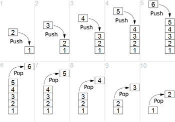
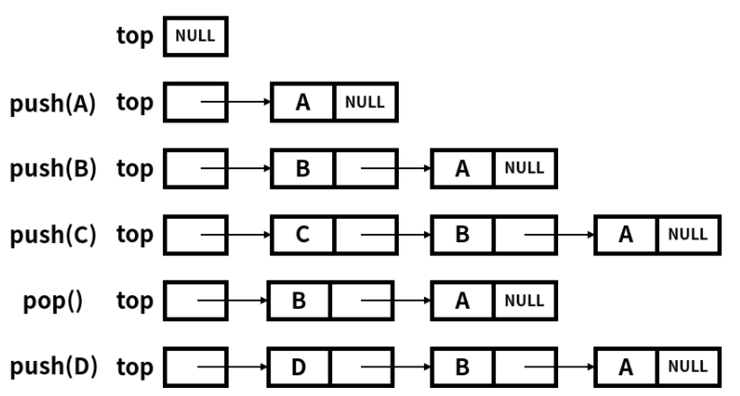
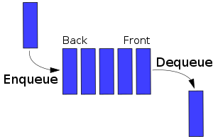

# Stack
## :bamboo:Definition
스택은 여러 원소를 다루는 ADT로 크게 2개의 메인 연산을 가진다.
* **push**: 스택의 맨위에 원소를 넣는다.
* **pop**: 스택의 맨위의 원소를 뺀다.

스택은 **선형 자료구조**로써 **last in first out**(LIFO)라는 원리로 작동하는 데 스택에 쌓을 때(push)는 맨위에 쌓이고 나올 때(pop)는 마지막에 쌓인 원소가 나온다.
아래의 그림이 직관적으로 스택을 설명한다.

책에 따라서는 메인 연산에서 top이라는 연산을 추가하여 3개라고 설명하는 데도 있다. top은 **최상위 원소를 제거하지 않고 리턴**한다. 여담으로 가장 상위의 원소를 top이라고도 부르기도 한다.

 

## :straight_ruler:Stack implementation
스택은 간단한 자료 구조로 배열과 링크드 리스트로 손쉽게 구현할 수 있다. 보통 위에서 언급한 3개의 **연산과 비어있는 지 확인하는 empty**, **스택의 원소 개수를 리턴하는 size**를 구현한다.

아래 그림처럼 스택을 구현할 때 top을 트리의 root처럼 정하고 구현하기도 한다. 

 

## :busts_in_silhouette:Common uses of stack
스택이 쓰이는 곳의 예시는 아래와 같다.
* git의 stash
* backtracking
* 메인 메모리 스택
* html 태그 해석

 
 

# Queue

## :dango:Definition
큐는 스택과 마찬가지로 여러 원소를 다루는 ADT이고 선형 자료구조이다. 큐의 메인 연산 2개는 아래와 같다.
* **enqueue** : 큐의 뒤(rear)에 원소를 넣는다.
* **dequeue** : 큐의 앞(front)의 원소를 삭제한다.

큐는 **first in first out**(FIFO)의 원리로 작동하는 데 스택의 pop과는 다르게 먼저 들어간 원소가 나오게 된다.

큐는 맨 앞과 뒤의 원소들을 각각 front, rear(back)으로 표현하고 스택과 비슷하게 empty, size를 같이 구현한다.

 

## :busts_in_silhouette:Common usees of queue
* bfs
* 프린터

 
 

**Reference**

https://en.wikipedia.org/wiki/Stack_(abstract_data_type)

https://en.wikipedia.org/wiki/Queue_(abstract_data_type)