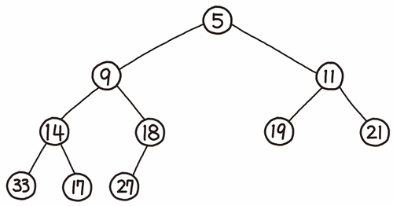
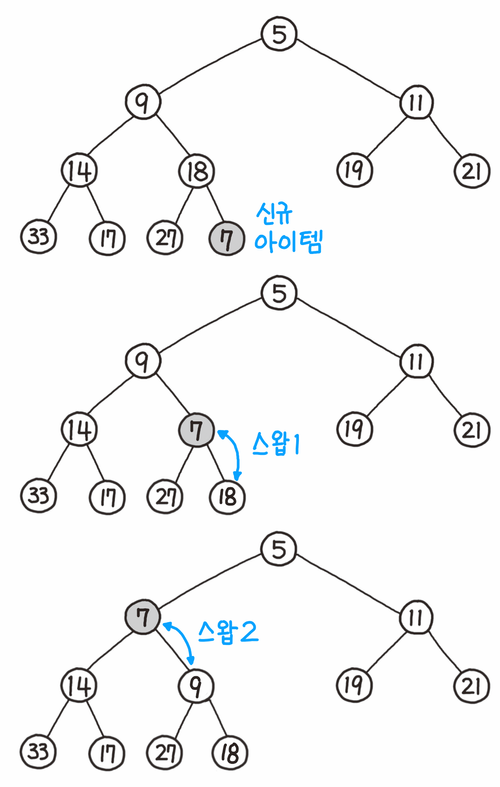
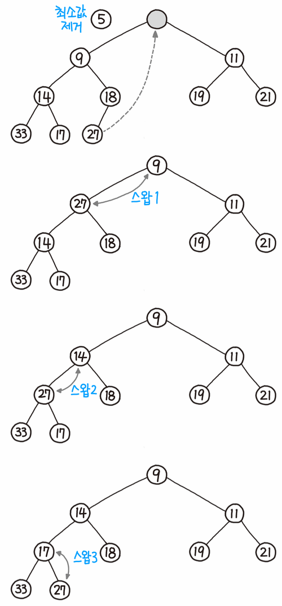

# Heap
힙은 **완전 트리** 기반 자료구조이고 ADT 중 하나인 **우선순위 큐**의 효율적인 구현 방법이다.(사실 우선순위 큐랑 많이 혼용되서 불리긴 한다.) 여기서 완전 트리는 마지막을 제외한 모든 노드에서 **자식들이 꽉 채워진 트리**를 의미한다.

힙은 **중복 값을 허용**하고 우선순위가 **가장 높은 원소를 항상 루트**에 저장하게 된다. 부모노드가 자식노드 보다 값이 항상 크면 최대힙, 반대의 경우 최소힙이라고 한다. 이렇게 완전한 정렬을 이루지 않아 **느슨한 정렬상태**(반정렬 상태)라고 한다. 메인 연산으로는 삽입, 삭제가 있다.

* 삽입: 원소를 힙에 넣는 연산 O(nlogn)
* 삭제: 원소를 힙에서 삭제하는 연산 O(nlogn)



<br>

## Insertion & deletion
삽입, 삭제를 할 때 경우에 따라 힙의 조건(i.e. 부모노드의 값이 자식노드의 값보다 작아야 한다)이 깨질 수 있다. 이를 막기 위해 삽입, 삭제를 하고 나서  heapify라는 재구조화 작업이 든다. 그래서 삽입, 삭제는 O(1)이지만 heapity에서 O(nlogn)이 걸린다.
### 삽입
* 가장 끝의 자리에 노드를 삽입한다.
* 그 노드와 부모 노드를 서로 비교한다.
* 규칙에 맞으면 그대로 두고, 그렇지 않으면 부모 노드와 교환한다.
* 규칙에 맞을 때까지 3번 과정을 반복한다.



### 삭제
* 루트 노드를 제거
* 루트 자리에 가장 마지막 노드를 삽입
* 올라간 노드와 그 자식 노드와 비교한다.
* comparison protocol
    * 최대 힙
        * 부모보다 더 큰 자식이 없으면 교환하지 않고 끝낸다.
        * 부모보다 더 큰 자식이 하나만 있으면 그 자식하고 교환하면 된다.
        * 부모보다 더 큰 자식이 둘 있으면 자식들 중 큰 값과 교환한다.
    * 최소 힙
        * 부모보다 더 작은 자식이 없으면 교환하지 않고 끝낸다.
        * 부모보다 더 작은 자식이 하나만 있으면 그 자식하고 교환하면 된다.
        * 부모보다 더 작은 자식이 둘 있으면 자식들 중 작은 값과 교환한다.
* 정렬이 될 때까지 이 과정을 반복



<br>

## :triangular_ruler: priority_queue
cpp에서는 priority_queue라는 라이브러리가 있다. 이를 이용해서 힙을 쓸 수 있다.

```cpp
#include <functional>
#include <queue>
#include <vector>
#include <iostream>
 
template<typename T>
void print_queue(T q) { // NB: pass by value so the print uses a copy
    while(!q.empty()) {
        std::cout << q.top() << ' ';
        q.pop();
    }
    std::cout << '\n';
}

struct stock{
    int index;
    int price;

    stock(int _index, int _price){
        index = _index;
        price = _price;
    }
};

// price를 기준으로 내림차순 정렬할때 사용
struct compare{
    bool operator()(const stock a, const stock b){
        return a.price < b.price;
    }
};

int main() {
    std::priority_queue<int> q;
 
    const auto data = {1,8,5,6,3,4,0,9,7,2};
 
    for(int n : data)
        q.push(n);
 
    print_queue(q);
 
    std::priority_queue<int, std::vector<int>, std::greater<int>>
        q2(data.begin(), data.end());
 
    print_queue(q2);
 
    // Using lambda to compare elements.
    priority_queue<stock, vector<stock>, compare> pq;
}

// 9 8 7 6 5 4 3 2 1 0 
// 0 1 2 3 4 5 6 7 8 9 
```

구조체 compare 함수를 써야하는 이유 >> https://huilife.tistory.com/entry/C-Priority-Queue%EC%9D%98-custom-sort

<br>

## reference
https://en.wikipedia.org/wiki/Heap_(data_structure)

https://en.cppreference.com/w/cpp/container/priority_queue
