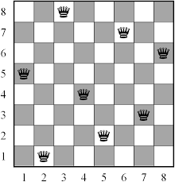

# Brute force(완전 탐색)
완전 탐색(완탐)은 구현이 쉽고 해가 존재한다면 무조건 해를 찾을 수 있다. **모든 경우의 수**를 찾기 때문에 데이터의 크기가 어느정도 제한되어야 쓸 수 있다.

더 빠르게 해를 찾기위해서는 **해의 후보군 공간을 줄이는 것**이 좋다. 

예를 들어 8개의 퀸이라는 문제는 체스판에서 8개의 퀸을 배치했을 때 사는 경우를 묻는 문제이다. 이를 완탐으로 풀 경우 64^8 = 281,474,976,710,656을 다 둘러봐야 한다. 여기서 **다른 퀸은 같은 칸에 있을 수 없다는 전제**를 이용하면 조합을 통해 64!/(56!*8!) = 4,426,165,368로 위의 경우보다 많이 줄어듬을 알 수 있다. 이처럼 분석을 통해서 문제를 풀 수 있게끔 바꿀 수 있다.

이런 완탐 알고리즘을 대체할 수 있는 것은 minmax로 탐색 도중에 서브트리를 삭제하여 해의 후보군을 줄일 수 있다.

 

# greedy algorithm
탐욕 알고리즘은 각 단계에서 지역적으로 최적의 해를 찾는 방법이다. 이런 **어떤 선택을 하든 지역적으로 최적의 해를 이용하여 하위 문제를 해결할 수 있고 전역의 해에 영향을 끼치지 않는다**는 것이 대전제이므로 이를 어기는 문제에는 사용할 수 없다. 여기서 탐욕 알고리즘은 선택을 다시 되돌아보지 않는다(재고)는 점에서 동적 프로그래밍과 다르다.

## Reference

https://en.wikipedia.org/wiki/Brute-force_search

https://en.wikipedia.org/wiki/Greedy_algorithm