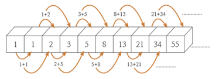

# :star:Dynamic Programming(DP)
큰 문제를 작은 문제로 나누어 푸는 방법을 의미한다.  DP는 3가지의 조건을 가진다.
* 하나의 문제는 여러개의 작은 문제로 나뉜다.
* 같은 문제는 **구할 떄마다 정답이 같다.**
* **작은 문제가 반복**이 일어난다.

위의 조건을 만족하면 **Memorization**이라는 작은 문제들의 결과값을 저장하는 방법을 사용할 수 있다. 이 방법을 통해 하나의 문제를 풀 때 필요한 작은 문제들의 답들을 한번 구했으면 다시 구하지 않아도 되기에 문제를 빨리 풀 수 있다.

 

## :crystal_ball:피보나치 수열

보통 피보나치가 DP의 대표적인 예로써 설명이 된다.

위의 그림의 경우 박스에 해당 인덱스의 피보나치 수열 값이 저장되어 있다는 것을 확인할 수 있다.

* 하나의 문제는 여러개의 작은 문제로 나뉜다.

    fb(i) = fb(i-1) + fb(i-2) 처럼 전에 풀었던 문제의 값을 이용할 수 있다.

* 같은 문제는 구할 떄마다 정답이 같다.

* 작은 문제들이 반복된다.

앞에서 언급한 조건들을 만족하는 것을 볼 수 있다.

 
 

# DFS
* 그래프 전체를 탐색하는 방법 중 하나로써 시작점부터 다음 branch로 넘어가기 전에 해당 branch를 완벽하게 탐색하고 넘어가는 방법.
* **재귀함수**(왠만하면 1만번을 안넘게 구현) 혹은 **스택**을 통해 구현한다. 
* 노드 방문시 **방문 여부**를 반드시 검사를 해야 무한 루프에 빠지지 않는다. 
* 깊이 제한에 도달할 때까지 목표 노드가 발견되지 않으면 최근에 첨가된 **부모 노드로 돌아와(백트래킹)** 다른 자식 노드를 순회한다.

### 장점
* 한 경로의 노드만을 기억하면 되므로 저장공간의 수요가 비교적 적다.

### 단점
* 얻어진 해가 최단 경로가 된다는 보장이 없다. 이는 목표에 이르는 경로가 다수인 문제에 대해 DFS는 해에 다다르면 탐색을 끝내버리므로, 이때 얻어진 해는 최적이 아닐 수도 있다.

# BFS
* DFS와 마찬가지로 그래프 전체를 탐색하는 방법 중 하나
* 시작 노드를 방문한 후 시작 노드에 있는 인접한 모든 노드들을 우선 방법.
* 큐를 이용하여 구현한다.
 

### 장점
* 출발노드에서 목표노드까지의 최단 길이 경로를 보장

### 단점
* 경로가 매우 길 경우에는 탐색 가지가 급격히 증가함에 따라 보다 많은 기억 공간을 필요

 
 

### Reference
https://galid1.tistory.com/507

https://better-tomorrow.tistory.com/entry/DFS-BFS-%EC%9D%B4%ED%95%B4%ED%95%98%EA%B8%B0
